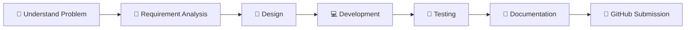

<div align="center">


# 💻 Software Engineering

### 📚 Academic Assignment Repository


<br>


</div>

---

# 📖 About

Welcome to my **Software Engineering Academic Repository**.

This repository contains all assignments, reports, source code, presentations, documentation, and learning resources prepared for the **Software Engineering** course.

The repository is organized according to the **Course Outcomes (CO1–CO5)**, and each Course Outcome contains **three Assessment Tasks (AT-1, AT-2, and AT-3)**.

The objective of this repository is to maintain a clean, organized, and version-controlled record of all academic work throughout the semester.

---

# 👨‍🎓 Student Information

| 📝 Information | 📌 Details |
|---------------|------------|
| 👤 Student Name | **Paleru Dharani Govardhan** |
| 🆔 Register Number | **192525280** |
| 🏫 Institution | **SIMATS Engineering** |
| 🤖 Department | Artificial Intelligence & Machine Learning |
| 📖 Course | Software Engineering |
| 👩‍🏫 Faculty | **Mrs. Anita Davamani** |
| 💻 Repository | **Software-Engineering** |

---

# 🎯 Repository Objectives

✔ Maintain all assignments in one place

✔ Learn Software Engineering concepts effectively

✔ Organize submissions Course Outcome wise

✔ Track academic progress

✔ Demonstrate Git & GitHub usage

✔ Build a professional academic portfolio

---

# 📚 Course Outcomes

| Course Outcome | Description |
|---------------|-------------|
| 🟢 **CO-1** | Advanced Methodologies & Agile Project Management |
| 🔵 **CO-2** | Requirements Engineering & Software Architecture |
| 🟣 **CO-3** | Full Stack Development, Docker & Git |
| 🟠 **CO-4** | Testing, DevOps & Continuous Delivery |
| 🔴 **CO-5** | Software Maintenance & Emerging Technologies |

---
# 📂 Repository Structure

```text
Software-Engineering/
│
├── 📁 CO-1
│   ├── 📂 AT-1
│   ├── 📂 AT-2
│   └── 📂 AT-3
│
├── 📁 CO-2
│   ├── 📂 AT-1
│   ├── 📂 AT-2
│   └── 📂 AT-3
│
├── 📁 CO-3
│   ├── 📂 AT-1
│   ├── 📂 AT-2
│   └── 📂 AT-3
│
├── 📁 CO-4
│   ├── 📂 AT-1
│   ├── 📂 AT-2
│   └── 📂 AT-3
│
├── 📁 CO-5
│   ├── 📂 AT-1
│   ├── 📂 AT-2
│   └── 📂 AT-3
│
└── 📄 README.md
```

---

# 📋 Assignment Progress

| Course Outcome | AT-1 | AT-2 | AT-3 | Status |
|:--------------:|:----:|:----:|:----:|:------:|
| 🟢 CO-1 | ✅ | ⏳ | ⏳ | In Progress |
| 🔵 CO-2 | ⏳ | ⏳ | ⏳ | Pending |
| 🟣 CO-3 | ⏳ | ⏳ | ⏳ | Pending |
| 🟠 CO-4 | ⏳ | ⏳ | ⏳ | Pending |
| 🔴 CO-5 | ⏳ | ⏳ | ⏳ | Pending |

---

# 📊 Semester Progress

```text
CO-1    ███████░░░░░░░░░░░ 33%

CO-2    ░░░░░░░░░░░░░░░░░░ 0%

CO-3    ░░░░░░░░░░░░░░░░░░ 0%

CO-4    ░░░░░░░░░░░░░░░░░░ 0%

CO-5    ░░░░░░░░░░░░░░░░░░ 0%
```

---

# 🛠 Technologies & Tools

<div align="center">


</div>

---

# 📚 Repository Contents

| 📂 Category | Description |
|-------------|-------------|
| 📄 Assignment Reports | Assessment reports and documentation |
| 💻 Source Code | Programming implementations |
| 📊 PowerPoint Presentations | Academic PPTs |
| 📘 Notes | Course notes and references |
| 🖼 Diagrams | UML, Flowcharts & Architecture |
| 📑 PDFs | Supporting documents |
| 📚 Study Material | Additional learning resources |

---

# 🚀 Software Engineering Skills Covered

- 📌 Agile Methodologies
- 📌 Scrum Framework
- 📌 SDLC Models
- 📌 Requirements Engineering
- 📌 Software Architecture
- 📌 API Design
- 📌 Git & GitHub
- 📌 Docker
- 📌 Kubernetes Basics
- 📌 Software Testing
- 📌 DevOps
- 📌 Continuous Integration
- 📌 Continuous Deployment
- 📌 Software Maintenance
- 📌 Emerging Technologies

---

# 📈 Repository Statistics

```text
📂 Total Course Outcomes      : 5

📝 Assessment Tasks           : 15

📄 README Files               : 1

📊 Presentations              : Updating...

💻 Programs                   : Updating...

📚 Reports                    : Updating...

📅 Semester                   : Current

🚀 Repository Status          : Active
```

---

# 🏆 Milestones

✅ Repository Created

⬜ CO-1 Completed

⬜ CO-2 Completed

⬜ CO-3 Completed

⬜ CO-4 Completed

⬜ CO-5 Completed

🎯 Semester Completed

---
# 🔄 Academic Workflow

```text
                    📚 COURSE SYLLABUS
                           │
                           ▼
                  🎯 COURSE OUTCOME (CO)
                           │
                           ▼
                 📝 ASSESSMENT TASK (AT)
                           │
                           ▼
               💻 IMPLEMENTATION / CODING
                           │
                           ▼
                 📄 DOCUMENTATION / REPORT
                           │
                           ▼
                  📤 GITHUB SUBMISSION
                           │
                           ▼
                  🎓 FACULTY EVALUATION
```

---

# 🌟 Development Workflow



---

# 📌 Repository Guidelines

✔ Keep every assignment inside its respective **Course Outcome** folder.

✔ Store all related files inside the appropriate **Assessment Task** folder.

✔ Use meaningful filenames.

✔ Update the repository after every assignment.

✔ Maintain proper documentation.

✔ Follow Git best practices.

✔ Keep the repository clean and organized.

---

# 🎯 Repository Goals

- 📚 Organize academic work efficiently

- 💻 Learn Software Engineering practically

- 📁 Maintain structured submissions

- 📈 Track semester progress

- 🚀 Improve GitHub portfolio

- 📖 Build good documentation habits

---

# ⭐ Best Practices Followed

- ✅ Version Control using Git

- ✅ Clean Folder Structure

- ✅ Proper Documentation

- ✅ Academic Organization

- ✅ Continuous Updates

- ✅ Professional Repository Management

---

# 📅 Assignment Timeline

```text
Semester
│
├── CO-1
│   ├── AT-1
│   ├── AT-2
│   └── AT-3
│
├── CO-2
│   ├── AT-1
│   ├── AT-2
│   └── AT-3
│
├── CO-3
│   ├── AT-1
│   ├── AT-2
│   └── AT-3
│
├── CO-4
│   ├── AT-1
│   ├── AT-2
│   └── AT-3
│
└── CO-5
    ├── AT-1
    ├── AT-2
    └── AT-3
```

---

# 📖 References

- 📘 Course Notes

- 📗 Faculty Materials

- 📄 Assignment Instructions

- 📚 Software Engineering Reference Books

- 💻 GitHub Documentation

- 🐳 Docker Documentation

---

# 🤝 Contribution

This repository is maintained exclusively for **academic purposes**.

Suggestions and improvements are always welcome.

---

# 📜 License

This repository is intended for educational use only.

All assignments, reports, documentation, presentations, and source code are submitted as part of the **Software Engineering** course requirements.

---

<div align="center">

## 🌟 Thank You for Visiting


<br>

### 👨‍🎓 Paleru Dharani Govardhan

**Artificial Intelligence & Machine Learning**

**Software Engineering Assignment Repository**

**Faculty : Mrs. Anita Davamani**

**SIMATS Engineering**

---

⭐ *"Code. Learn. Build. Improve. Repeat."*

<br>


</div>
